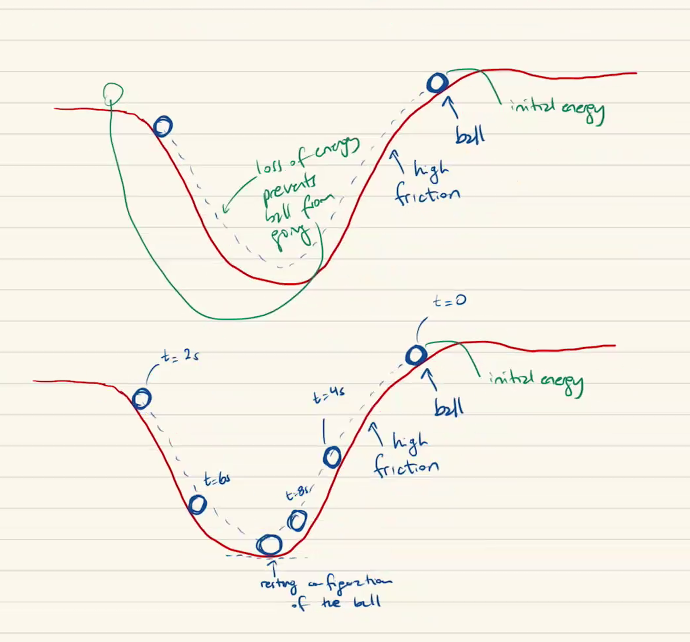
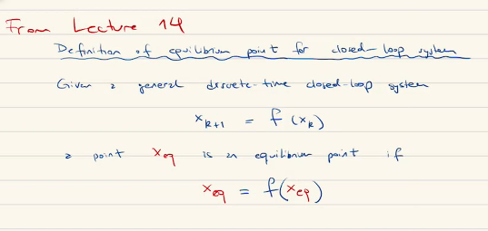
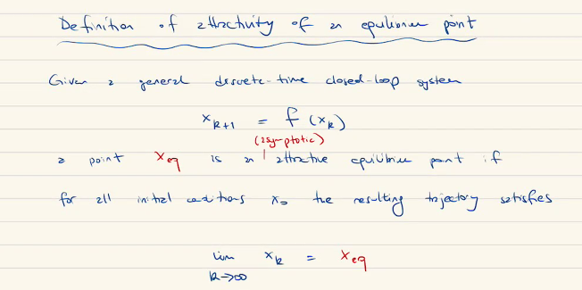
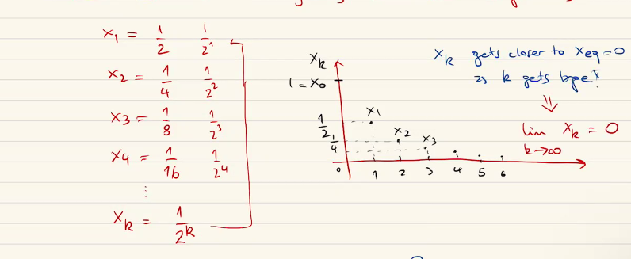

---
header-includes:
  - \usepackage{enumitem}
  - \setlistdepth{20}
  - \renewlist{itemize}{itemize}{20}
  - \renewlist{enumerate}{enumerate}{20}
  - \setlist[itemize]{label=$\cdot$}
  - \setlist[itemize,1]{label=\textbullet}
  - \setlist[itemize,2]{label=--}
  - \setlist[itemize,3]{label=o}
output:
  rmarkdown::pdf_document:
    keep_tex: yes
---

# ECE 8 Robotics Notes 11-8-22

- Review last weeks Equilibrium notes
- Stability or Equilibrium point
- Recall the cruise control model
  - the fixed IC and find $v_eq$
  - is an attractive point, such that the model trajectories converge to this point
  - $v_eq = v_d$

# Lecture 15:

## Example 9: Ball moving on a Terrain

- Consider a ball that is initialized with zero velocity at a positive height and moves along the following terrain
- See Figure 1
- Assume friction does exist

  - if we have an initial energy, then that energy is consumed by the friction
  - aka the energy decreases due to friction
    Cases for the ball rolling: Depends on where the ball is initially released from
  - BUT friction can cause the ball from not reaching certain points along the terrain

- Equilibrium point of a ball in a "well" is at the bottom of the well
  - equilibrium point is a value of our key variable (in this case velocity or position or energy) and it remains there after a time, forever
  - if we push the ball in this case slightly, it still remains near the equilibrium point

## Now consider a ball on a Hill

- See Figure 2
- there is an equilibrium point at the top of the hill but it is not very stable
  - any push will cause it to fall to either side of the hill
  - if the ball has no velocity at the top of the hill, then it will stay at the top for all time. This is why we call it an equilibrium point

## Conclusions

- Ball in Well behavior is a stable equilibrium
  - trajectories stay near the eq. point
- Ball on Hill behavior is unstable equilibrium
  - trajectories do not remain near the eq. point

## Definition of Stability of an Equilibrium point

Given a general discrete closed-loop system

$$
x_{k+1} = f(x_k)
$$

$f(x_k)$ models the dynamics of the full system.

A point $x_{eq}$ is a stable equilibrium point if for all initial conditions (IC) nearby $x_{eq}$ the resulting trajectories remain nearby $x_{eq}$.

### Revisit Example 7 : Cruise Control

- From Lect. 14
  We know that,
  $$
  v_{eq} = v_d
  $$
- the equilibrium point is equal to our desired point, but is it stable or unstable?

- From our simulations during lecture 14 we had the following plots (see figure 3):

## In Class Activities

`IMPORTANT: THIS IS GOING TO BE ON THE QUIZ`

1. Consider the discrete time model
   $$
   x_{k+1} = \frac{1}{2}x_k
   $$

- a. Calculate the equilibrium point for the system
  - from lecture: 14 ( See figure 4)

- Solution:

  - We have $x_{k+1} = f(x_k)$ but $f(x_k) =\frac{1}{2}x_k$ so we get $x_{eq} = x_k$ because (see Figure) $x_{eq} = f(x_{eq})$
  - To solve for the exact value we do the following:
    $$
     x_{eq} = f(x_{eq} ) = \frac{1}{2}x_{eq} \\
     x_{eq} = \frac{1}{2}x_{eq} \\
    $$
    Combine like terms
    $$
    0 = \frac{1}{2}x_{eq}  - x_{eq} \\
    0 = -\frac{1}{2}x_{eq}
    $$
    but this is only true (LHS = RHS) if $x_{eq} = 0$

---

-` b. Numerically: Is the equilibrium point attractive? (stable)`

- from lecture:14 (see figure 5)

- We need to show that every trajectory to $x_{k_+1} = (1/2)\cdot x_k$ such that the limit

  $$
  \lim\limits_{k\rightarrow\infty} x_k = x_{eq}
  $$

  - Consider $x_0 = 1$ out IC, then we get

$$
x_1 = 1/2 \\
x_2 = 1/4 \\
x_3 = 1/8 \\
\dots \\
x_k = 1/2^k
$$

- test this:

  - $k=0$ is $1/2$, $k=1$ then $1/4$, we can plot these values
  - See Figure 6

  

  - Want To Show: this equation is true regardless of what our IC is ($x_0$) (regardless from where we start)
  - This is true, (proof not given, proof is only shown with the diagram),
  - Due to how the points behave on our graph we see they "converge" to zero so then $x_{eq}= 0$ is attractive

---

- `c. Is the equilibrium point stable? (this follows from 1b)`

  - from lecture: 15
  - Solution:
    - The point $x_{eq} = 0$ is stable because from the answer to 1b. we see that the initial distance of $x_0$ to $x_{eq}$ is the largest distance along the trajectory.
    - if the trajectory starts close to $x_{eq}$ then it remains close by $x_{eq}$

---

2. Consider the cruise control model
   $$
   v_{k+1} = v_k + \Delta \frac{-bv_k}{m}
   $$

- a. `Find` $v_{eq}$

  `IMPORTANT: KNOW THIS FOR QUIZ`

  - found in previous lecture
  - value: (let $v_{eq} = v_k$)
    $$
    v_{eq} = f(v_{eq}) \\
    v_{eq} = v_k + \Delta \frac{-bv_k}{m}\\
    \dots \\
    v_{eq} = v_k = 0
    $$

- b. `is it attractive?`
  - Prove that for each IC $v_0$, we have
    $$
    \lim\limits_{k\rightarrow\infty}v_k = v_{eq} = 0
    $$
  - for the resulting trajectories of the given model, also given by $v_k$
  - To do this we use simulations
  - Q: what values of $b,m,\Delta$ should be used?
  - unless $b,m, \Delta$ are fixed we cannot answer this, because there are too many different systems to simulate
- c. `is it stable?`

  `Same issue:`

  - Q: what values of $b,m,\Delta$ should be used?
  - unless $b,m, \Delta$ are fixed we cannot answer this, because there are too many different systems to simulate

# Stability and attractively of an equilibrium point (special case)

If the discrete time model is of the form

$$
x_{k+1} = a\cdot x_k
$$

where $a\in\mathbf{R}$ and $x_k$ is a trajectory with $x_k$ a real number (not a vector of dimension 2 or larger) then the equilibrium point for the system

$$
x_{k+1} = a\cdot x_k
$$

is both stable and attractive (asymptotically stable) if

$$
a \neq 0 \\
|a| <1 \text{  absolute value of a is smaller than 1}
$$

hold.

For the cruise control

$$
v_{k+1} = v_k + \Delta \frac{-bv_k}{m}\\
$$

$$
v_{k+1} = v_k - (\Delta \frac{b}{m})v_k\\
$$

Let $a = - (\Delta \frac{b}{m})$ and apply the conditions $a$ mentioned above, and this will allow us to test our model's equilibrium points.

## Closing Remarks

- Quiz on Thursday
- Think about/consider:

  - $x_{k+1} = 2x_k$
  - Determine eq. points
  - stability
  - attractively
  - notice this value is larger than 1, and may break the conditions we did previously

- No quiz until after Thanks giving
- A catch up quiz will come up and can be taken at any point before finals
- If we are not in person on Thursday we will have the quiz on canvas
- Lab is due Monday after Thanksgiving ! (More than 12 days to solve)
- 3 quizzes (2 required, 1 Extra credit)
- 2 more labs
- experiments on the last weeks of class

# Lab 4 due: Nov. 28th

- Working with CoppeliaSim !
  - make sure it works before the holiday
- simulate the movement of quadcopter
- record data
- store data
- Use MATLAB to plot the trajectories
- this lab covers your ability to code, not the physics
