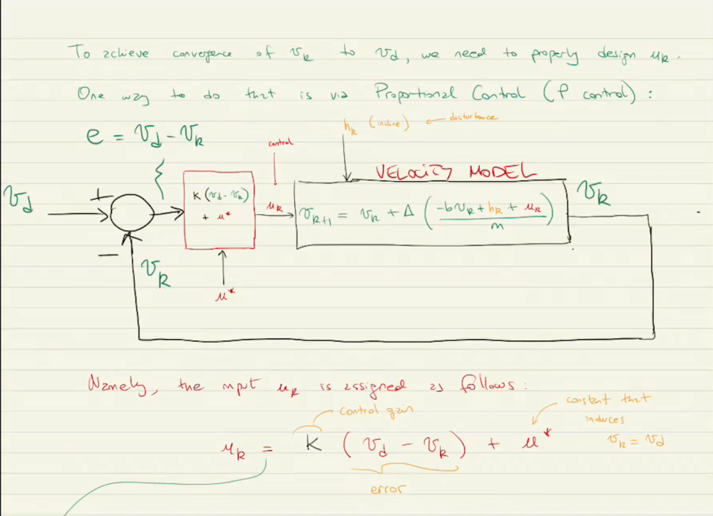
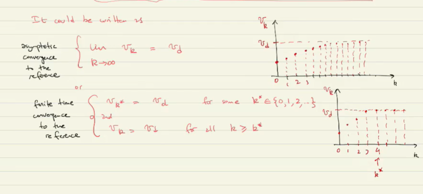

---
header-includes:
  - \usepackage{enumitem}
  - \setlistdepth{20}
  - \renewlist{itemize}{itemize}{20}
  - \renewlist{enumerate}{enumerate}{20}
  - \setlist[itemize]{label=$\cdot$}
  - \setlist[itemize,1]{label=\textbullet}
  - \setlist[itemize,2]{label=--}
  - \setlist[itemize,3]{label=*}
output:
  rmarkdown::pdf_document:
    keep_tex: yes
---

# ECE 8 Robotics Notes 11-3-22

- Start of class comments:
  - Proportional control
  - Tuesday: Virtual Simulation
  - Last week of classes we do experiments in the labs
  - Important image:

\newpage

## Move to Matlab

- see file `CruiseControl.m` and `CruiseControlv1.m`

## Lecture 12

- Today we will design the proportional control we introduced in lecture 10 for the cruise control system

## Example 7 (revisited)

- From example 7 in lecture 10 we have simulated the previous image with:

$$\text{Zero inputs} \begin{cases} \mu_k = 0 & \text{for all } k \\ h_k = 0 & \text{for all} k \end{cases}$$

- To implement Proportional Control we define the controller block (the block before the velocity model)

  - This issues the control signal by calculating the error between the desired and current velocity
    $$\mu_k = K\cdot(v_d - v_k) + \mu^*$$
  - $K$ = Control gain
  - $\mu^*$ = Constant input/ steady state input

- Our design problem:

  - Given parameters of the system:
    - parameters (related to the physics)
      - $m$ = mass
      - $b$ = friction/resistance
    - step size (part of the model)
      - $\Delta$ = essentially how much do we want to compute or how fast
  - Given the specifications of the desired speed $v_d$
  - As a designer we need to find $K$ and $\mu^*$

    - We want to achieve/our goal for a cruise control algorithm
      - we want $v_k$ to approach $v_d$ as discrete time increases

- We can show [ $v_k$ approaching $v_d$ ] mathematically: "limit"

  - (The following is fun facts)
  - See Figure 2

  - $v_k$ approaching $v_d$ can be written mathematically as:
    - aka Asymptotic convergence to the reference
    - requires infinitely many steps to arrive

  $$\lim\limits_{k \to \infty}v_k = vd$$

  - or for discrete case:
    - aka finite time convergence to the reference
    - requires a finite amount of steps to arrive

  $$\begin{cases} v_{k^*} = v_d & \text{ for some} k^*\in \{0,1,2,\dots\} \\ v_k = v_d & \text{for all } k  k^*  \end{cases}$$

## Moved to MATLAB for in class practice

- See his handwritten notes for explicit definitions from the equations to the code.
- Written in blue, below the boxes

### Find $\mu^*$ and $K$

- Recall from lect 10-25-22
  - We found
    $$
    u^* = bv_d \\
    K = 0
    $$
  - if we let $v_0 = v_d$ which led to $u_0 = u^*$

IMPORTANT:

- the professor jumps between:
  $$
  u = \mu \\
  u^* = \mu^*
  $$
